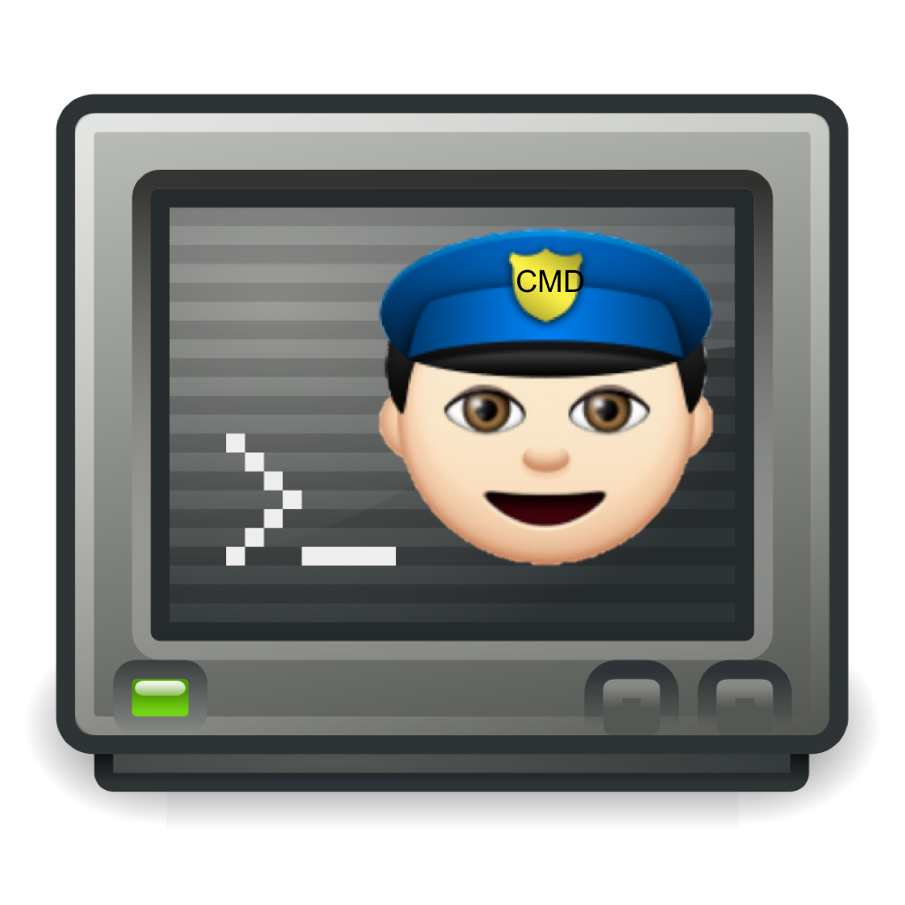

# CMD. Parser  
 

The Slack Bot that parses bash commands off terminal screenshots.

Have you ever received a screenshot of a small and unreadable terminal? Have you
had to open it, zoom and attempt to decipher what they typed in their rainbow
coloured terminal?

CMD. Parser is here to save you, your patience and your eyes...

CMD. Parser will analyze the screenshot and return only the information you care about... the commands.

## Installation

1. Login to Slack https://slack.com/
2. Press the gear icon at the top of the page
3. Select 'add app or integreation'
4. Select 'manage' in the top right corner
5. Select 'custom integrations'
6. Add outgoing webhook
7. Set trigger word to 'cmd'
8. Add the following urls to the url box:
https://qufrvi3nyi.execute-api.us-west-2.amazonaws.com/dev/
https://52xkgnh3ej.execute-api.us-west-2.amazonaws.com/test
9. Press save

## Usage

Using a the simple command 'cmd' in your favourite slack channel and then a valid url. Ensure the file is accessable to the public internet

For a demo of comd. parser being used please check out the submission video
https://www.youtube.com/watch?v=VU5AoDQvN6Q

## Example Commands

- cmd https://raw.githubusercontent.com/Gknoblau/CMD.Parser/master/Example1.png
- cmd https://raw.githubusercontent.com/Gknoblau/CMD.Parser/master/Example2.png
- cmd https://raw.githubusercontent.com/Gknoblau/CMD.Parser/master/Example3.png

## What is CMD.Parser?
- Role: To make IT professionals’ lives easier by parsing commands from a terminal screenshot
- Uses Tesseract Optical Character Recognition engine to accurately parse various types of terminals commands
- Returns just the commands from the screenshot
- Input-> valid image url
- Output-> commands

## Why Would I use CMD.Parser?
- IT professions consistently get terminal screenshots from colleagues 
- They are often small and difficult to read
- You are unable to copy and paste commands used in the screenshot.
- CMD. Parser solves these problem by returning the commands you need to use in your own terminal

## Applications
- Parsing commands off hard to read terminals
- Large screenshots with > 5 commands
- Getting commands to create scripts
- Terminal beginners

## How Does CMD.Parser Do It?
- Use Slack’s Outgoing Webhook, AWS Lambda processes the request
- Image URL is validated
- Image is resized using OpenCV
- OCR (Tesseract) is used to get text from image
- String splice only the command after the ‘>’ or ‘$’ character
- Return the commands via Slacks Incoming Webhook
